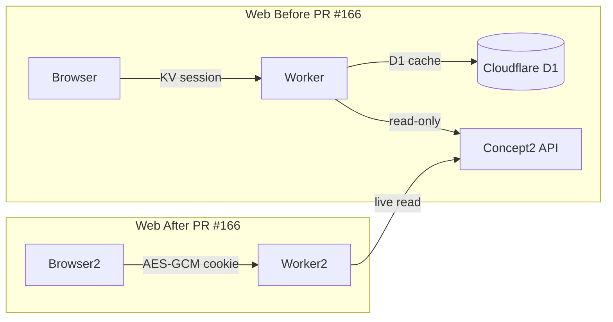
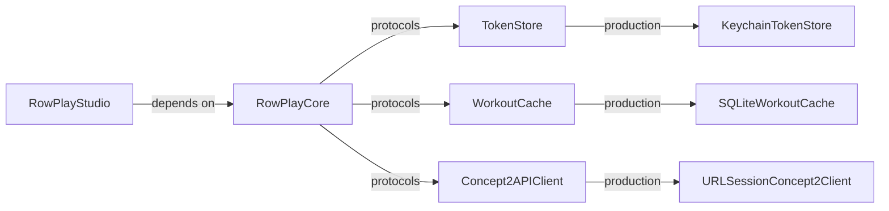

# Reconcile RowPlay Studio With rowplay PR #166 — Design

## Summary

This is a docs/specs-only PR. It reconciles RowPlay Studio's roadmap,
source-map, beta-readiness notes, and steering docs with the post-PR-166
stateless web architecture. No product features, UI, network behavior, or
SQLite changes are introduced.

## Web architecture change

The web app no longer has server-side workout storage. All authenticated data
is fetched live from Concept2 per request. Session identity is sealed in
AES-GCM httpOnly cookies (`rp_session`, `rp_tok`).

## Native architecture (unchanged)

RowPlay Studio's native SQLite cache remains valid as a native-local/offline
capability. It is not web D1 parity because D1 no longer exists in the web
architecture.

## Changes

### docs/roadmap.md

- Add "Web Architecture Baseline" section near the top.
- Review each phase for stale KV/D1/sync/feature language and make surgical
  corrections.

### docs/source-map.md

- Mark retired web files (db.ts, detailCache.ts, historyWindow.ts, share.ts,
  leaderboard.ts, rivalGhost.ts, hrImport.ts, syncState, compare page,
  leaderboard page, public share page, annotation panel, tag badge,
  migrations, wrangler.jsonc KV/D1 bindings) as retired.
- Label native SQLite entries as "Native-only local cache, not web D1 parity."
- Add reference to web `.kiro/specs/remove-kv-d1/`.

### docs/beta-readiness.md

- Add "rowplay PR #166 Impact" section.

### .kiro/steering/structure.md

- Update the note about Cloudflare assumptions to reflect that the web app
  itself no longer uses KV/D1.

### .kiro/steering/tech.md

- No changes needed unless stale language is found.

### AGENTS.md

- Verify `WorkoutCache` production status is accurate (SQLite is implemented).
- Ensure no steering tells agents to port KV/D1 behavior.

## Non-goals

- No new product features.
- No UI changes.
- No network behavior changes.
- No SQLite removal or schema changes.
- No Bluetooth or hardware work.
